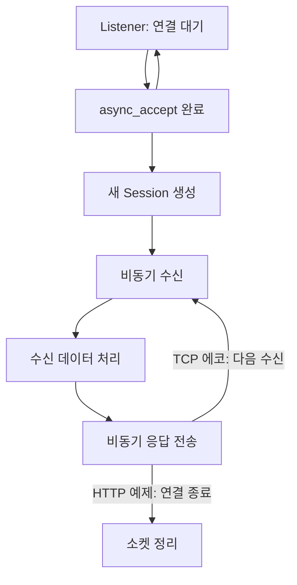

<div align="center">

# 🌐 Network Socket Lab

### C++와 Boost로 살펴보는 네트워크 프로그래밍

**TCP · UDP · Serialization · HTTP · Async I/O · Multithreading**


소켓 연결과 메시지 전송에서 시작해, 이벤트 기반 서버 구조까지 확장하는 실습 모음입니다.

[실습 목차](#-실습-목차) · [핵심 개념](#-핵심-개념) · [개발 환경](#-개발-환경) · [실행 안내](#-실행-안내) · [기술 블로그](https://blog.naver.com/pathfinder7777/224060111420)

</div>

---

## 📘 프로젝트 소개

**Network-Socket**은 C++ 네트워크 프로그래밍의 동작 원리를 이해하기 위한 단계별 학습 저장소입니다.

Boost.Asio로 TCP·UDP 통신과 비동기 I/O를 구현하고, Boost.Serialization으로 객체를 직렬화하며, Boost.Beast로 HTTP 요청과 응답을 다룹니다. 이후에는 세션 분리, REST 라우팅, 여러 스레드에서의 이벤트 처리로 범위를 넓힙니다.

> 각 디렉터리는 독립적인 실습입니다. 일부 예제는 구현 중이거나 수정이 필요한 상태이므로, 아래 실행 안내와 예제별 보완 항목을 함께 확인합니다.

## 🗺️ 실습 목차

| 단계 | 디렉터리 | 주요 내용 |
| :---: | --- | --- |
| **01** | [`day1`](day1) | 동기 TCP 서버·클라이언트, 에코 통신 |
| **02** | [`day2`](day2) | UDP 데이터그램 송수신과 에코 |
| **04** | [`day4_async`](day4_async) | 비동기 연결·수신·송신, TCP 세션 |
| **05** | [`day5_serialization`](day5_serialization) | `Dogs` 객체의 텍스트 아카이브 직렬화·역직렬화 |
| **06** | [`day6_async_serial`](day6_async_serial) | `Person` 객체의 직렬화 및 비동기 TCP 전송 |
| **07** | [`day7_http`](day7_http) | Beast HTTP 서버, `/index.html` 요청 처리 |
| **08** | [`day8_httpclient`](day8_httpclient) | HTTP/1.1 GET 요청과 응답 출력 |
| **09** | [`day9_beast_httpserver`](day9_beast_httpserver) | Listener·Session 분리형 비동기 HTTP 서버 |
| **10** | [`day10_RestApi`](day10_RestApi) | `/users` 라우팅, 사용자 모델 및 관리 클래스 |
| **11** | [`day11_WebSocket`](day11_WebSocket) | WebSocket 서버 실행 진입점; 구현 헤더 누락 |
| **12** | [`day12_multithread_server`](day12_multithread_server) | 여러 스레드가 공유하는 `io_context`, TCP 에코 |
| **13** | [`day13_AsyncIO_event_driven`](day13_AsyncIO_event_driven) | 이벤트 기반 TCP 에코 서버 구조 |

단계 번호는 저장소의 디렉터리명을 따릅니다. `day3` 디렉터리는 현재 포함되어 있지 않습니다.

## 🧠 핵심 개념

| 개념 | 코드에서 살펴볼 부분 |
| --- | --- |
| **TCP와 UDP** | 연결형 바이트 스트림과 데이터그램 기반 송수신 |
| **동기·비동기 I/O** | 작업 완료까지 기다리는 호출과 완료 핸들러 등록 |
| **메시지 경계** | 개행 기반 `read_until`, 고정 버퍼, 직렬화 데이터의 길이 처리 |
| **세션 수명** | `shared_from_this()`와 콜백 캡처를 통한 객체 유지 |
| **직렬화** | C++ 객체를 전송 가능한 아카이브로 표현 |
| **HTTP** | 메서드·경로·헤더·본문·상태 코드 처리 |
| **멀티스레딩** | 여러 스레드의 `io_context::run()` 실행 |

`io_context`의 생성자에 숫자를 전달하는 것만으로 스레드가 만들어지는 것은 아닙니다. Day 12는 `std::thread`를 직접 생성하여 여러 스레드에서 `run()`을 호출합니다.

## 🔄 비동기 서버 구조

아래는 여러 예제에서 사용하는 Listener–Session 구조를 요약한 개념도입니다.



이 구조에서 **세션뿐 아니라 송신 버퍼와 응답 객체도 비동기 작업 완료까지 살아 있어야 합니다.** 일부 예제에는 이 수명 관리의 보완이 필요합니다.

## 🛠️ 개발 환경

| 항목 | 저장소 기준 |
| --- | --- |
| IDE | Visual Studio 2022 |
| 도구 집합 | MSVC v143 |
| 플랫폼 | Windows, 프로젝트별 Win32/x64 구성 |
| 네트워크 | Boost.Asio |
| HTTP | Boost.Beast |
| 직렬화 | Boost.Serialization |
| 사용자 ID | Boost.UUID |

프로젝트의 기존 include·library 경로는 **Boost 1.89.0** 디렉터리를 참조합니다. Boost 본체는 별도로 준비하고, 자신의 설치 위치로 경로를 변경해야 합니다.

### Visual Studio 설정

- **C/C++ → 일반 → 추가 포함 디렉터리**: `boost/` 하위 폴더가 들어 있는 Boost 루트
- **링커 → 일반 → 추가 라이브러리 디렉터리**: 해당 빌드 구성과 맞는 Boost 라이브러리 위치
- 직렬화 예제에는 Boost.Serialization의 컴파일된 라이브러리가 필요합니다.
- x64/Win32, Debug/Release 및 런타임 설정을 라이브러리와 일치시킵니다.

경로는 선택한 플랫폼·구성별로 확인합니다. 일부 파일은 CP949 인코딩의 한글을 포함하므로 소스를 열 때 인코딩도 확인합니다.

## 🚀 실행 안내

### 저장소 내려받기

```powershell
git clone https://github.com/path0971/Network-Socket.git
cd Network-Socket
```

각 실습의 `.sln`을 열고 실행할 프로젝트를 빌드합니다. Day 11에는 `.vcxproj`만 있으며, 필요한 헤더가 빠져 있습니다.

### 서버와 클라이언트 분리

Day 1·2·4의 프로젝트에는 각각 `main()`이 있는 여러 소스가 포함되어 있습니다. 이 파일들을 한 실행 파일로 함께 링크하면 진입점 중복 문제가 발생합니다.

**서버와 클라이언트를 별도 콘솔 프로젝트로 구성**하거나, 실행하려는 소스만 빌드에 포함하도록 나머지 파일을 제외합니다. 서버를 먼저 실행한 뒤 별도 터미널에서 클라이언트를 실행합니다.

### 기본 주소와 포트

| 실습 | 통신 설정 |
| --- | --- |
| Day 1 TCP | 서버 `12345`, 클라이언트 `127.0.0.1:12345` |
| Day 2 UDP | 서버 `7777`, 클라이언트 `127.0.0.1:7777` |
| Day 4·6 TCP | 서버 `7777`, 클라이언트 `127.0.0.1:7777` |
| Day 7·9·10 HTTP | `0.0.0.0:7777` |
| Day 8 HTTP 클라이언트 | `www.example.com:80`, `/index.html` |
| Day 11 진입점 | `0.0.0.0:7777` |
| Day 12 TCP | `127.0.0.1:7777` |
| Day 13 TCP | `0.0.0.0:7777` |

같은 주소·TCP 포트를 사용하는 서버 예제는 하나씩 실행하거나 포트를 변경합니다. `0.0.0.0`은 서버의 바인딩 주소이며, 같은 PC에서 접속할 때는 `127.0.0.1`을 사용합니다.

### HTTP 요청 예시

Day 7의 응답 객체 수명 문제를 보완한 뒤, PowerShell에서 요청할 수 있습니다.

```powershell
curl.exe -i http://127.0.0.1:7777/index.html
```

코드에 정의된 정상 응답은 `200`과 `Hello, World!`입니다. Day 8 클라이언트를 로컬 서버에 연결하려면 `host`를 `127.0.0.1`, `port`를 `7777`로 변경합니다.

Day 10의 응답 객체 수명 문제를 보완한 뒤에는 다음 라우팅을 확인할 수 있습니다.

```powershell
curl.exe -i http://127.0.0.1:7777/users
curl.exe -i http://127.0.0.1:7777/users/sample-id
curl.exe -i -X POST http://127.0.0.1:7777/users
curl.exe -i -X DELETE http://127.0.0.1:7777/users/sample-id
```

현재 REST 핸들러는 설명 문자열을 반환합니다. `UserManager`와 실제 요청 처리가 연결되어 있지 않아 사용자 데이터가 생성·조회·삭제되는 완성형 CRUD API는 아닙니다.

## 🔧 예제별 보완 항목

소스 검토에서 확인한 사항입니다. README 작성 과정에서 코드를 수정하거나 Windows 빌드·통신 테스트를 수행하지는 않았습니다.

<details>
<summary><strong>실행 전 확인할 내용 펼치기</strong></summary>

| 실습 | 확인할 내용 |
| --- | --- |
| Day 1 기본 TCP | 서버 메시지에 개행이 없지만 클라이언트는 `read_until("\n")` 사용. 송수신 메시지 경계를 일치시켜야 함 |
| Day 1 에코 | 서버는 연결당 한 번 응답 후 소켓을 닫지만 클라이언트는 같은 연결로 반복 전송. 연결 정책 조정 필요 |
| Day 2 UDP | 클라이언트 소켓을 생성한 뒤 프로토콜을 지정하여 열지 않음. `socket.open(udp::v4())` 등으로 초기화 필요 |
| Day 4 클라이언트 | 지역 문자열을 `async_write()` 버퍼로 사용. 완료까지 유지되는 멤버 또는 공유 객체로 보관 필요 |
| Day 6 직렬화 통신 | 클라이언트가 1024바이트 전체를 기다리는 `async_read()` 사용. 실제 전송 길이에 맞는 프레이밍·EOF 처리 필요 |
| Day 7·9·10 HTTP | 지역 응답 객체를 비동기 쓰기에 전달. 완료 핸들러까지 응답 객체의 소유권 유지 필요 |
| Day 9 HTTP | 정상 응답 생성·전송 코드가 주석 처리되어 있음 |
| Day 10 REST | 사용자 관리 클래스는 있지만 HTTP 핸들러는 실제 관리 메서드를 호출하지 않음 |
| Day 11 WebSocket | `mainS.cpp`에서 참조하는 `AsyncWebSocketServer.h`가 저장소에 없음 |
| Day 12·13 Listener | 임시 `shared_ptr`로 시작하고 콜백은 `this`만 캡처. Listener를 계속 소유하거나 `shared_from_this()`로 수명 유지 필요 |
| Day 12 스레드 | 작업 스레드에 대한 `join()`과 정상 종료 절차 보완 필요 |

`&&` 매개변수로 받거나 `std::move()`를 사용했다는 사실만으로 비동기 응답 객체의 수명이 연장되지는 않습니다. 실제 객체를 멤버 또는 콜백이 소유하는 공유 객체에 유지해야 합니다.

</details>

## 🌱 확장 방향

- [ ] 예제별 실행 타깃과 의존성 설정 통일
- [ ] 비동기 버퍼·세션·리스너 수명 관리 보완
- [ ] 길이 헤더 또는 구분자 기반 TCP 메시지 프레이밍
- [ ] HTTP 응답 및 연결 유지 정책 정리
- [ ] REST 핸들러와 사용자 저장소 연결
- [ ] WebSocket 구현 파일 추가
- [ ] 정상 종료, 오류 처리 및 통신 테스트

## 📚 학습 기록

**[C++ 소켓 프로그래밍 · Boost.Asio 학습 기록 →](https://blog.naver.com/pathfinder7777/224060111420)**

---

<div align="center">

**Network Socket Lab**<br>
소켓에서 프로토콜로, 동기 호출에서 이벤트 기반 처리로

</div>
